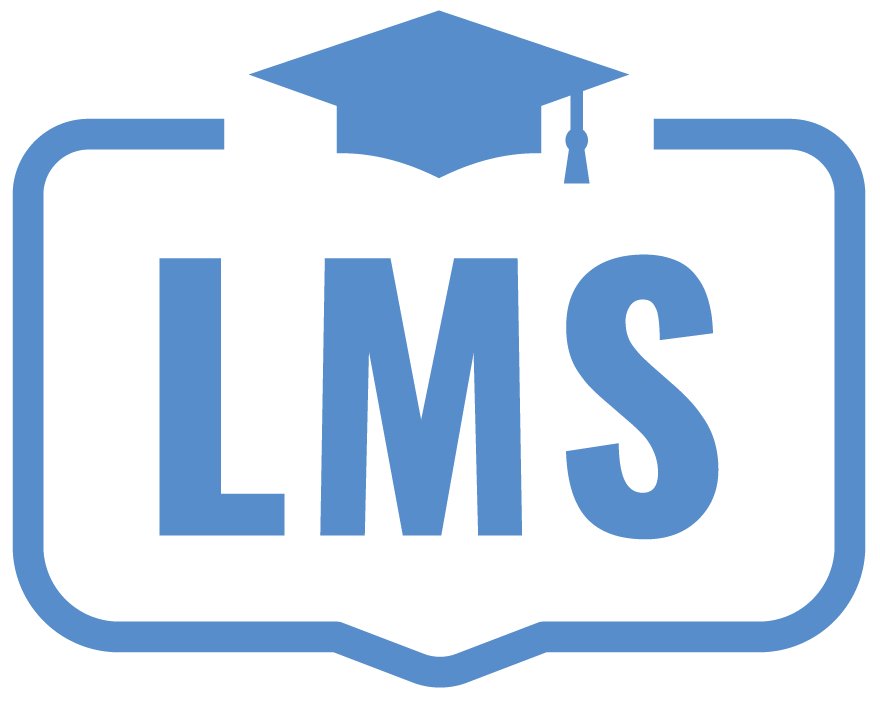

[](https://www.python.org/downloads/release/python-360/)
[![Contributors][contributors-shield]][contributors-url]
[![Issues][issues-shield]][issues-url]
[![MIT License][license-shield]][license-url]
[![LinkedIn][linkedin-shield]][linkedin-url]


<!-- PROJECT LOGO -->
<br />
<p align="center">
    
  </a>

  <h3 align="center">Learning-Management-System</h3>

  <p align="center">
    Boilerplate LMS application built using django-rest-frmaework!
    <br />
    <br />
    <br />
    <a href="mailto:umairqadir97@gmail.com">Request Demo</a>
    ·
    <a href="https://github.com/umairqadir97/learning-management-system/issues">Report Bug</a>
    ·
    <a href="https://github.com/umairqadir97/learning-management-system/issues">Request Feature</a>
  </p>
</p>


<!-- TABLE OF CONTENTS -->
## Table of Contents

* [About the Project](#about-the-project)
  * [Built With](#built-with)
* [Getting Started](#getting-started)
  * [Prerequisites](#prerequisites)
  * [Installation](#installation)
* [Roadmap](#roadmap)
* [Contributing](#contributing)
* [License](#license)
* [Contact](#contact)


<!-- ABOUT THE PROJECT -->
## About The Project

[![Product Name Screen Shot][product-screenshot]](#about-the-project)


This application is a sample of in-house built product Learning Management System with modern cutting edge technologies to ease the learning process. Implemented core backend engine and supporting apps for
handling accounts, courses, assignments, discussions and quizzes.


Key Learning:
* Setting up boilerplates for django project
* RESTful API development
* Handling large code base :smile:

Of course, no one template will serve everyone since your needs may be different. So I'll be adding more in the near future. You may also suggest changes by forking this repo and creating a pull request or opening an issue.

[Contributors are always welcomed!](#contributing)

<br>

### Built With

* [Python](http://python.org/)
* [Django](https://www.djangoproject.com/)


<!-- GETTING STARTED -->
## Getting Started


To get a local copy up and running follow these simple example steps.

### Prerequisites

To run this project,  you should have following dependencies ready:

1. Python3
2. pip
2. MySQL Database


<br>

### Installation


1. Clone the repo
```sh
git clone https://github.com/umairqadir97/learning-management-system.git
```
2. Open terminal in project folder
```sh 
cd learning-management-system
```

3. Install python packages
```sh
pip3 install -r requirements.txt
```

4. Create 'prepboard_staging' database in MySQL
```sql
CREATE DATABASE prepboard_staging;
```

4. Enter your database login credentials in `engine/settings.py`
```py
'NAME': 'prepboard_staging',
'USER': 'user_name',
'PASSWORD': 'password',
```

6. Run server
```sh
python3 manage.py runserver
```

<br>

<!-- ROADMAP -->
## Roadmap

See the [open issues](https://github.com/umairqadir97/learning-management-system/issues) for a list of proposed features (and known issues).


<!-- CONTRIBUTING -->
## Contributing

Contributions are what make the open source community such an amazing place to be learn, inspire, and create. Any contributions you make are **greatly appreciated**.

1. Fork the Project
2. Create your Feature Branch (`git checkout -b amazing_features`)
3. Commit your Changes (`git commit -m 'Add some Amazing Features'`)
4. Push to the Branch (`git push origin amazing_features`)
5. Open a Pull Request


### Contribution guidelines
1. Writing tests
2. Code review
3. Feature Enhancement

<!-- LICENSE -->
## License

Distributed under the MIT License. See `LICENSE` for more information.


<!-- CONTACT -->
## Contact

Muhammad Umair Qadir - [Email](umairqadir97@gmail.com)

LinkedIn: [LinkedIn](https://linkedin.com/in/umairqadir)


<!-- MARKDOWN LINKS & IMAGES -->

<!-- Contributors -->
[contributors-shield]: https://img.shields.io/github/contributors/othneildrew/Best-README-Template.svg?style=flat-square
[contributors-url]: https://github.com/umairqadir97/learning-management-system/graphs/contributors

<!-- Issues -->
[issues-shield]: https://img.shields.io/github/issues/othneildrew/Best-README-Template.svg?style=flat-square
[issues-url]: https://github.com/umairqadir97/learning-management-system/issues

<!-- Lisence -->
[license-shield]: https://img.shields.io/github/license/othneildrew/Best-README-Template.svg?style=flat-square
[license-url]: https://github.com/umairqadir97/learning-management-system/blob/master/LICENSE.txt

<!-- LinkedIn -->
[linkedin-shield]: https://img.shields.io/badge/-LinkedIn-black.svg?style=flat-square&logo=linkedin&colorB=555
[linkedin-url]: https://linkedin.com/in/umairqadir

<!-- Product Screenshot -->
[product-screenshot]: reports/api_ready.png